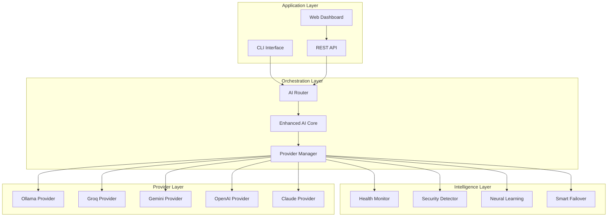

# 🛠️ IRIS AI Orchestration System - Developer Guide

**Version**: 2.0 Production Ready  
**Target Audience**: Developers, System Integrators, DevOps Engineers  
**Difficulty Level**: Intermediate to Advanced

---

## 🎯 Overview for Developers

This guide provides comprehensive technical documentation for developers who want to:
- Integrate IRIS into their applications
- Extend IRIS functionality
- Contribute to the IRIS codebase
- Build custom providers or plugins
- Deploy IRIS in production environments

---

## 📚 Table of Contents

1. [Architecture Overview](#-architecture-overview)
2. [API Reference](#-api-reference)
3. [Integration Patterns](#-integration-patterns)
4. [Custom Provider Development](#-custom-provider-development)
5. [Extension Development](#-extension-development)
6. [Testing & Quality Assurance](#-testing--quality-assurance)
7. [Deployment & DevOps](#-deployment--devops)
8. [Performance Optimization](#-performance-optimization)
9. [Security Implementation](#-security-implementation)
10. [Contributing Guidelines](#-contributing-guidelines)

---

## 🏗️ Architecture Overview

### Core System Design



### Module Structure

```
src/
├── index.js                 # Main MultiAI class
├── enhanced-ai.js           # CLI entry point
├── cli.js                   # Command line interface
├── core/
│   ├── ai-router.js         # Provider routing logic
│   ├── provider-manager.js  # Provider lifecycle management
│   ├── health-monitor.js    # System health monitoring
│   ├── security-detector.js # Threat detection
│   ├── neural-learning.js   # Adaptive learning
│   └── smart-failover.js    # Failover mechanisms
├── providers/
│   ├── base-provider.js     # Abstract provider class
│   ├── ollama-provider.js   # Local Ollama integration
│   ├── groq-provider.js     # Groq API integration
│   ├── gemini-provider.js   # Google Gemini integration
│   ├── openai-provider.js   # OpenAI API integration
│   └── claude-provider.js   # Anthropic Claude integration
└── utils/
    ├── config-manager.js    # Configuration handling
    ├── logger.js            # Logging utilities
    └── validators.js        # Input validation
```

---

## 🔧 API Reference

### Core Class: MultiAI

#### Constructor

```javascript
import MultiAI from './src/index.js';

const iris = new MultiAI({
    configPath: './config/iris-config.json',  // Optional: custom config
    logLevel: 'info',                         // Optional: debug, info, warn, error
    enableMetrics: true,                      // Optional: performance tracking
    enableSecurity: true                      // Optional: security features
});
```

#### Primary Methods

##### `initializeProviders(options)`

```javascript
const providerStatus = await iris.initializeProviders({
    ollamaHost: 'http://localhost:11434',    // Optional: Ollama server
    timeout: 30000,                          // Optional: initialization timeout
    skipHealthCheck: false                   // Optional: skip initial health checks
});

// Returns: { [providerId]: { available: boolean, status: string, ... } }
```

##### `chat(message, options)`

```javascript
const response = await iris.chat("Your query here", {
    taskType: 'balanced',     // Optional: code, creative, fast, reasoning, balanced
    provider: 'auto',         // Optional: specific provider ID or 'auto'
    maxCost: 0.05,           // Optional: maximum cost per query (USD)
    timeout: 30000,          // Optional: response timeout (ms)
    stream: false,           // Optional: streaming response
    context: [],             // Optional: conversation context
    temperature: 0.7,        // Optional: response creativity (0-1)
    maxTokens: 1000         // Optional: maximum response length
});

// Response object structure:
{
    response: "Generated text response",
    provider: "ollama",              // Provider that handled the request
    model: "qwen2.5:7b",            // Specific model used
    responseTime: 1250,             // Time taken in milliseconds
    tokensUsed: 45,                 // Tokens consumed
    cost: 0.0,                      // Cost in USD
    confidence: 0.95,               // Confidence score (0-1)
    contextLength: 150,             // Context window used
    decision: {
        reason: "Optimal for balanced tasks",
        useMistral: true,
        alternatives: ["groq", "openai"],
        criteria: {
            taskMatch: 0.9,
            healthScore: 0.95,
            costEfficiency: 1.0
        }
    },
    metadata: {
        timestamp: "2025-09-01T12:00:00.000Z",
        sessionId: "uuid-string",
        requestId: "uuid-string"
    }
}
```

##### `getProviderStatus()`

```javascript
const status = iris.getProviderStatus();

// Returns:
{
    ollama: {
        available: true,
        status: 'healthy',
        health: 98,
        responseTime: 145,
        successRate: 0.985,
        lastCheck: "2025-09-01T12:00:00.000Z",
        models: ['qwen2.5:7b', 'mistral:7b']
    },
    // ... other providers
}
```

##### `getSystemMetrics()`

```javascript
const metrics = iris.getSystemMetrics();

// Returns:
{
    uptime: 3600000,                    // System uptime in ms
    totalRequests: 1247,               // Total requests processed
    successRate: 0.953,                // Overall success rate
    averageResponseTime: 856,          // Average response time in ms
    totalCost: 0.23,                   // Total cost incurred (USD)
    providerDistribution: {            // Request distribution
        ollama: 542,
        groq: 389,
        gemini: 234,
        openai: 82
    },
    errorsByType: {                    // Error breakdown
        timeout: 12,
        authentication: 3,
        rate_limit: 8,
        provider_unavailable: 5
    }
}
```

### REST API Endpoints

#### Chat Endpoint

```http
POST /api/chat
Content-Type: application/json

{
    "message": "Your query here",
    "provider": "auto",           // Optional
    "taskType": "balanced",       // Optional
    "options": {                  // Optional
        "maxCost": 0.05,
        "timeout": 30000,
        "temperature": 0.7
    }
}
```

Response:
```json
{
    "response": "Generated response",
    "provider": "ollama",
    "model": "qwen2.5:7b",
    "responseTime": 1250,
    "success": true,
    "metadata": {
        "tokensUsed": 45,
        "cost": 0.0,
        "confidence": 0.95
    }
}
```

#### Health Check Endpoint

```http
GET /api/health
```

Response:
```json
{
    "status": "healthy",
    "timestamp": "2025-09-01T12:00:00.000Z",
    "providers": {
        "ollama": { "available": true, "health": 98 },
        "groq": { "available": true, "health": 96 }
    },
    "metrics": {
        "uptime": 3600000,
        "totalRequests": 1247,
        "successRate": 0.953
    }
}
```

#### Provider Status Endpoint

```http
GET /api/providers
```

Response: Provider status object (see `getProviderStatus()` above)

---

## 🔌 Integration Patterns

### Node.js Application Integration

#### Basic Integration

```javascript
import MultiAI from 'iris-ai';

class MyService {
    constructor() {
        this.iris = new MultiAI();
        this.initialized = false;
    }
    
    async initialize() {
        if (!this.initialized) {
            await this.iris.initializeProviders();
            this.initialized = true;
        }
    }
    
    async generateResponse(userQuery, context = []) {
        await this.initialize();
        
        try {
            const response = await this.iris.chat(userQuery, {
                context,
                maxCost: 0.02  // Budget constraint
            });
            
            return {
                text: response.response,
                provider: response.provider,
                cost: response.cost
            };
        } catch (error) {
            console.error('IRIS request failed:', error);
            throw new Error('AI service unavailable');
        }
    }
}
```

#### Express.js Middleware

```javascript
import express from 'express';
import MultiAI from 'iris-ai';

const app = express();
const iris = new MultiAI();

// Middleware to initialize IRIS
app.use(async (req, res, next) => {
    if (!req.iris) {
        req.iris = iris;
        if (!iris.initialized) {
            await iris.initializeProviders();
            iris.initialized = true;
        }
    }
    next();
});

// Chat endpoint
app.post('/chat', async (req, res) => {
    try {
        const { message, options = {} } = req.body;
        
        const response = await req.iris.chat(message, {
            taskType: options.taskType || 'balanced',
            maxCost: options.maxCost || 0.05
        });
        
        res.json({
            success: true,
            data: response
        });
    } catch (error) {
        res.status(500).json({
            success: false,
            error: error.message
        });
    }
});
```

### React.js Frontend Integration

#### Custom Hook

```javascript
import { useState, useEffect, useCallback } from 'react';

export function useIRIS(baseUrl = 'http://localhost:3001') {
    const [loading, setLoading] = useState(false);
    const [error, setError] = useState(null);
    
    const chat = useCallback(async (message, options = {}) => {
        setLoading(true);
        setError(null);
        
        try {
            const response = await fetch(`${baseUrl}/api/chat`, {
                method: 'POST',
                headers: { 'Content-Type': 'application/json' },
                body: JSON.stringify({ message, ...options })
            });
            
            if (!response.ok) throw new Error('Request failed');
            
            const data = await response.json();
            return data;
        } catch (err) {
            setError(err.message);
            throw err;
        } finally {
            setLoading(false);
        }
    }, [baseUrl]);
    
    const getHealth = useCallback(async () => {
        const response = await fetch(`${baseUrl}/api/health`);
        return response.json();
    }, [baseUrl]);
    
    return { chat, getHealth, loading, error };
}
```

#### Component Usage

```javascript
import React, { useState } from 'react';
import { useIRIS } from './hooks/useIRIS';

export function ChatComponent() {
    const [message, setMessage] = useState('');
    const [responses, setResponses] = useState([]);
    const { chat, loading, error } = useIRIS();
    
    const handleSubmit = async (e) => {
        e.preventDefault();
        if (!message.trim()) return;
        
        try {
            const response = await chat(message, {
                taskType: 'balanced'
            });
            
            setResponses(prev => [...prev, {
                query: message,
                response: response.response,
                provider: response.provider,
                timestamp: Date.now()
            }]);
            
            setMessage('');
        } catch (err) {
            console.error('Chat error:', err);
        }
    };
    
    return (
        <div className="chat-container">
            <form onSubmit={handleSubmit}>
                <textarea 
                    value={message}
                    onChange={(e) => setMessage(e.target.value)}
                    placeholder="Ask IRIS anything..."
                    disabled={loading}
                />
                <button type="submit" disabled={loading || !message.trim()}>
                    {loading ? 'Processing...' : 'Send'}
                </button>
            </form>
            
            {error && <div className="error">Error: {error}</div>}
            
            <div className="responses">
                {responses.map((item, idx) => (
                    <div key={idx} className="response">
                        <div className="query">You: {item.query}</div>
                        <div className="answer">
                            IRIS ({item.provider}): {item.response}
                        </div>
                    </div>
                ))}
            </div>
        </div>
    );
}
```

### Python Integration

#### Using subprocess

```python
import subprocess
import json
import shlex

class IRISClient:
    def __init__(self, iris_command='iris'):
        self.iris_command = iris_command
    
    def chat(self, message, task_type=None, provider=None):
        """Send a chat request to IRIS CLI"""
        cmd = [self.iris_command, 'chat', message]
        
        if task_type:
            cmd.extend(['--task', task_type])
        if provider:
            cmd.extend(['--provider', provider])
            
        try:
            result = subprocess.run(
                cmd, 
                capture_output=True, 
                text=True, 
                timeout=60
            )
            
            if result.returncode == 0:
                return {
                    'success': True,
                    'response': result.stdout.strip(),
                    'error': None
                }
            else:
                return {
                    'success': False,
                    'response': None,
                    'error': result.stderr.strip()
                }
        except subprocess.TimeoutExpired:
            return {
                'success': False,
                'response': None,
                'error': 'Request timeout'
            }
    
    def get_status(self):
        """Get IRIS system status"""
        try:
            result = subprocess.run(
                [self.iris_command, 'status', '--json'],
                capture_output=True,
                text=True,
                timeout=30
            )
            
            if result.returncode == 0:
                return json.loads(result.stdout)
            else:
                return None
        except (subprocess.TimeoutExpired, json.JSONDecodeError):
            return None

# Usage example
iris = IRISClient()

response = iris.chat("Write a Python function to calculate factorial")
if response['success']:
    print(f"IRIS: {response['response']}")
else:
    print(f"Error: {response['error']}")
```

#### Using HTTP API

```python
import requests
import json

class IRISAPIClient:
    def __init__(self, base_url='http://localhost:3001'):
        self.base_url = base_url
        self.session = requests.Session()
    
    def chat(self, message, **options):
        """Send chat request via REST API"""
        try:
            response = self.session.post(
                f"{self.base_url}/api/chat",
                json={
                    'message': message,
                    **options
                },
                timeout=60
            )
            response.raise_for_status()
            return response.json()
        except requests.exceptions.RequestException as e:
            return {
                'success': False,
                'error': str(e)
            }
    
    def get_health(self):
        """Get system health status"""
        try:
            response = self.session.get(f"{self.base_url}/api/health")
            response.raise_for_status()
            return response.json()
        except requests.exceptions.RequestException:
            return None

# Usage
api = IRISAPIClient()
result = api.chat("Explain machine learning", taskType="reasoning")
print(result['response'])
```

---

## 🔧 Custom Provider Development

### Provider Interface

All providers must implement the following interface:

```javascript
import { BaseProvider } from '../providers/base-provider.js';

export class CustomProvider extends BaseProvider {
    constructor(config = {}) {
        super('custom', config);
        this.apiKey = config.apiKey;
        this.baseUrl = config.baseUrl;
        this.models = config.models || ['default-model'];
    }
    
    /**
     * Check if provider is available
     * @returns {Promise<boolean>}
     */
    async isAvailable() {
        try {
            const response = await fetch(`${this.baseUrl}/health`);
            return response.ok;
        } catch (error) {
            return false;
        }
    }
    
    /**
     * Get available models
     * @returns {Promise<string[]>}
     */
    async getModels() {
        try {
            const response = await fetch(`${this.baseUrl}/models`, {
                headers: { 'Authorization': `Bearer ${this.apiKey}` }
            });
            const data = await response.json();
            return data.models || this.models;
        } catch (error) {
            return this.models;
        }
    }
    
    /**
     * Process chat request
     * @param {string} message - User message
     * @param {Object} options - Chat options
     * @returns {Promise<Object>} Response object
     */
    async chat(message, options = {}) {
        const startTime = Date.now();
        
        try {
            const response = await fetch(`${this.baseUrl}/chat`, {
                method: 'POST',
                headers: {
                    'Content-Type': 'application/json',
                    'Authorization': `Bearer ${this.apiKey}`
                },
                body: JSON.stringify({
                    message,
                    model: options.model || this.models[0],
                    temperature: options.temperature || 0.7,
                    max_tokens: options.maxTokens || 1000
                })
            });
            
            if (!response.ok) {
                throw new Error(`HTTP ${response.status}: ${response.statusText}`);
            }
            
            const data = await response.json();
            
            return {
                response: data.message,
                model: data.model || this.models[0],
                tokensUsed: data.tokens || 0,
                responseTime: Date.now() - startTime,
                cost: this.calculateCost(data.tokens || 0),
                provider: this.id
            };
        } catch (error) {
            throw new Error(`Custom provider error: ${error.message}`);
        }
    }
    
    /**
     * Calculate cost based on token usage
     * @param {number} tokens - Number of tokens used
     * @returns {number} Cost in USD
     */
    calculateCost(tokens) {
        // Example: $0.001 per 1000 tokens
        return (tokens / 1000) * 0.001;
    }
    
    /**
     * Check provider health
     * @returns {Promise<Object>} Health status
     */
    async checkHealth() {
        const startTime = Date.now();
        
        try {
            const available = await this.isAvailable();
            const responseTime = Date.now() - startTime;
            
            return {
                available,
                responseTime,
                health: available ? 100 : 0,
                status: available ? 'healthy' : 'unavailable',
                lastCheck: new Date().toISOString()
            };
        } catch (error) {
            return {
                available: false,
                responseTime: Date.now() - startTime,
                health: 0,
                status: 'error',
                error: error.message,
                lastCheck: new Date().toISOString()
            };
        }
    }
}
```

### Registering Custom Providers

```javascript
import MultiAI from './src/index.js';
import { CustomProvider } from './providers/custom-provider.js';

// Register custom provider
const iris = new MultiAI();

iris.registerProvider(new CustomProvider({
    apiKey: process.env.CUSTOM_API_KEY,
    baseUrl: 'https://api.custom-ai.com/v1',
    models: ['custom-model-1', 'custom-model-2']
}));

await iris.initializeProviders();
```

### Provider Configuration

Add provider configuration to `config/iris-config.json`:

```json
{
    "providers": {
        "custom": {
            "enabled": true,
            "priority": 6,
            "apiKey": "${CUSTOM_API_KEY}",
            "baseUrl": "https://api.custom-ai.com/v1",
            "models": ["custom-model-1", "custom-model-2"],
            "rateLimitRpm": 60,
            "timeout": 30000,
            "retryAttempts": 3,
            "costPerToken": 0.000001
        }
    }
}
```

---

## 🧩 Extension Development

### Plugin Architecture

IRIS supports plugins to extend functionality:

```javascript
// plugins/my-plugin.js
export class MyPlugin {
    constructor(iris) {
        this.iris = iris;
        this.name = 'MyPlugin';
        this.version = '1.0.0';
    }
    
    async initialize() {
        // Plugin initialization logic
        console.log(`${this.name} v${this.version} initialized`);
        
        // Hook into IRIS events
        this.iris.on('beforeChat', this.beforeChatHandler.bind(this));
        this.iris.on('afterChat', this.afterChatHandler.bind(this));
    }
    
    async beforeChatHandler(message, options) {
        // Pre-process messages
        console.log('Processing message:', message);
        
        // Modify options if needed
        if (message.includes('urgent')) {
            options.provider = 'groq';  // Force fast provider
        }
        
        return { message, options };
    }
    
    async afterChatHandler(response) {
        // Post-process responses
        console.log('Response received from:', response.provider);
        
        // Add custom metadata
        response.pluginMetadata = {
            processedBy: this.name,
            timestamp: Date.now()
        };
        
        return response;
    }
    
    cleanup() {
        // Cleanup when plugin is unloaded
        console.log(`${this.name} cleanup complete`);
    }
}
```

### Loading Plugins

```javascript
import MultiAI from './src/index.js';
import { MyPlugin } from './plugins/my-plugin.js';

const iris = new MultiAI();

// Load plugin
const plugin = new MyPlugin(iris);
await plugin.initialize();

// Use IRIS with plugin
const response = await iris.chat("This is urgent!");
console.log(response.pluginMetadata);
```

### Custom Commands

Add custom CLI commands:

```javascript
// commands/my-command.js
export async function myCommand(args, iris) {
    const { message, ...options } = args;
    
    console.log('Executing custom command...');
    
    // Custom processing logic
    const processedMessage = `[CUSTOM] ${message}`;
    
    const response = await iris.chat(processedMessage, options);
    
    console.log(`Custom response: ${response.response}`);
    return response;
}

// Register command
iris.registerCommand('mycmd', myCommand);
```

Usage:
```bash
iris mycmd "Hello world"
```

---

## 🧪 Testing & Quality Assurance

### Unit Testing

```javascript
// tests/providers/ollama-provider.test.js
import { describe, test, expect, beforeAll } from '@jest/globals';
import { OllamaProvider } from '../../src/providers/ollama-provider.js';

describe('OllamaProvider', () => {
    let provider;
    
    beforeAll(() => {
        provider = new OllamaProvider({
            host: 'http://localhost:11434'
        });
    });
    
    test('should initialize correctly', () => {
        expect(provider.id).toBe('ollama');
        expect(provider.host).toBe('http://localhost:11434');
    });
    
    test('should check availability', async () => {
        const available = await provider.isAvailable();
        expect(typeof available).toBe('boolean');
    });
    
    test('should handle chat requests', async () => {
        if (await provider.isAvailable()) {
            const response = await provider.chat('Hello', {
                model: 'qwen2.5:7b',
                timeout: 10000
            });
            
            expect(response).toHaveProperty('response');
            expect(response).toHaveProperty('model');
            expect(response).toHaveProperty('responseTime');
            expect(typeof response.response).toBe('string');
            expect(response.response.length).toBeGreaterThan(0);
        }
    }, 15000);
    
    test('should handle errors gracefully', async () => {
        const invalidProvider = new OllamaProvider({
            host: 'http://invalid-host:11434'
        });
        
        await expect(invalidProvider.chat('test')).rejects.toThrow();
    });
});
```

### Integration Testing

```javascript
// tests/integration/system.test.js
import { describe, test, expect, beforeAll } from '@jest/globals';
import MultiAI from '../../src/index.js';

describe('IRIS Integration Tests', () => {
    let iris;
    
    beforeAll(async () => {
        iris = new MultiAI({
            logLevel: 'error'  // Reduce noise in tests
        });
        await iris.initializeProviders();
    });
    
    test('should handle different task types', async () => {
        const tasks = [
            { message: 'Write hello world in Python', taskType: 'code' },
            { message: 'Write a short poem', taskType: 'creative' },
            { message: 'What is 2+2?', taskType: 'fast' },
            { message: 'Explain quantum computing', taskType: 'reasoning' }
        ];
        
        for (const task of tasks) {
            const response = await iris.chat(task.message, {
                taskType: task.taskType,
                timeout: 15000
            });
            
            expect(response).toHaveProperty('response');
            expect(response).toHaveProperty('provider');
            expect(response.response.length).toBeGreaterThan(10);
        }
    }, 60000);
    
    test('should respect cost constraints', async () => {
        const response = await iris.chat('Simple test', {
            maxCost: 0.001  // Very low cost limit
        });
        
        // Should route to free provider (Ollama)
        expect(['ollama', 'error'].includes(response.provider)).toBe(true);
    });
    
    test('should handle provider failures gracefully', async () => {
        // Mock provider failure by using invalid provider
        const response = await iris.chat('test', {
            provider: 'invalid-provider'
        });
        
        // Should fallback to available provider
        expect(response).toHaveProperty('response');
        expect(response.provider).not.toBe('invalid-provider');
    });
});
```

### Performance Testing

```javascript
// tests/performance/load.test.js
import { describe, test, expect } from '@jest/globals';
import MultiAI from '../../src/index.js';

describe('IRIS Performance Tests', () => {
    test('should handle concurrent requests', async () => {
        const iris = new MultiAI();
        await iris.initializeProviders();
        
        const concurrentRequests = 10;
        const requests = Array.from({ length: concurrentRequests }, (_, i) => 
            iris.chat(`Test query ${i}`, { timeout: 10000 })
        );
        
        const startTime = Date.now();
        const responses = await Promise.allSettled(requests);
        const totalTime = Date.now() - startTime;
        
        const successful = responses.filter(r => r.status === 'fulfilled');
        
        expect(successful.length).toBeGreaterThan(concurrentRequests * 0.8); // 80% success rate
        expect(totalTime).toBeLessThan(30000); // Complete within 30 seconds
        
        console.log(`Processed ${successful.length}/${concurrentRequests} requests in ${totalTime}ms`);
    }, 60000);
    
    test('should maintain response time SLA', async () => {
        const iris = new MultiAI();
        await iris.initializeProviders();
        
        const samples = 20;
        const responseTimes = [];
        
        for (let i = 0; i < samples; i++) {
            const startTime = Date.now();
            await iris.chat('Quick test', { taskType: 'fast' });
            const responseTime = Date.now() - startTime;
            responseTimes.push(responseTime);
        }
        
        const avgResponseTime = responseTimes.reduce((a, b) => a + b) / samples;
        const p95ResponseTime = responseTimes.sort((a, b) => a - b)[Math.floor(samples * 0.95)];
        
        expect(avgResponseTime).toBeLessThan(5000);  // Average under 5s
        expect(p95ResponseTime).toBeLessThan(10000); // 95th percentile under 10s
        
        console.log(`Avg: ${avgResponseTime}ms, P95: ${p95ResponseTime}ms`);
    }, 120000);
});
```

### Running Tests

```bash
# Install test dependencies
npm install --save-dev jest @jest/globals

# Run all tests
npm test

# Run specific test suite
npm test -- tests/providers/

# Run tests with coverage
npm test -- --coverage

# Run performance tests
npm test -- tests/performance/
```

---

## 🚀 Deployment & DevOps

### Docker Deployment

#### Dockerfile

```dockerfile
FROM node:18-alpine

# Install system dependencies
RUN apk add --no-cache git curl

# Set working directory
WORKDIR /app

# Copy package files
COPY package*.json ./

# Install dependencies
RUN npm ci --only=production

# Copy application code
COPY . .

# Create non-root user
RUN addgroup -g 1001 -S iris && \
    adduser -S iris -u 1001 -G iris

# Set ownership
RUN chown -R iris:iris /app
USER iris

# Expose port
EXPOSE 3001

# Health check
HEALTHCHECK --interval=30s --timeout=10s --start-period=5s --retries=3 \
    CMD curl -f http://localhost:3001/api/health || exit 1

# Start application
CMD ["node", "iris-api-server.js"]
```

#### Docker Compose

```yaml
# docker-compose.yml
version: '3.8'

services:
  iris-api:
    build: .
    ports:
      - "3001:3001"
    environment:
      - NODE_ENV=production
      - GROQ_API_KEY=${GROQ_API_KEY}
      - GEMINI_API_KEY=${GEMINI_API_KEY}
      - OPENAI_API_KEY=${OPENAI_API_KEY}
      - ANTHROPIC_API_KEY=${ANTHROPIC_API_KEY}
      - OLLAMA_HOST=http://ollama:11434
    depends_on:
      - ollama
    restart: unless-stopped
    volumes:
      - ./config:/app/config:ro
      - iris-logs:/app/logs
    networks:
      - iris-network

  ollama:
    image: ollama/ollama:latest
    ports:
      - "11434:11434"
    volumes:
      - ollama-data:/root/.ollama
    restart: unless-stopped
    networks:
      - iris-network
    # GPU support (uncomment if available)
    # deploy:
    #   resources:
    #     reservations:
    #       devices:
    #         - driver: nvidia
    #           count: 1
    #           capabilities: [gpu]

  nginx:
    image: nginx:alpine
    ports:
      - "80:80"
      - "443:443"
    volumes:
      - ./nginx.conf:/etc/nginx/nginx.conf:ro
      - ./ssl:/etc/nginx/ssl:ro
    depends_on:
      - iris-api
    restart: unless-stopped
    networks:
      - iris-network

volumes:
  ollama-data:
  iris-logs:

networks:
  iris-network:
    driver: bridge
```

### Kubernetes Deployment

```yaml
# k8s/deployment.yaml
apiVersion: apps/v1
kind: Deployment
metadata:
  name: iris-api
  labels:
    app: iris-api
spec:
  replicas: 3
  selector:
    matchLabels:
      app: iris-api
  template:
    metadata:
      labels:
        app: iris-api
    spec:
      containers:
      - name: iris-api
        image: iris-ai:2.0
        ports:
        - containerPort: 3001
        env:
        - name: NODE_ENV
          value: "production"
        - name: GROQ_API_KEY
          valueFrom:
            secretKeyRef:
              name: iris-secrets
              key: groq-api-key
        - name: GEMINI_API_KEY
          valueFrom:
            secretKeyRef:
              name: iris-secrets
              key: gemini-api-key
        resources:
          requests:
            memory: "256Mi"
            cpu: "200m"
          limits:
            memory: "1Gi"
            cpu: "500m"
        livenessProbe:
          httpGet:
            path: /api/health
            port: 3001
          initialDelaySeconds: 30
          periodSeconds: 10
        readinessProbe:
          httpGet:
            path: /api/health
            port: 3001
          initialDelaySeconds: 5
          periodSeconds: 5
---
apiVersion: v1
kind: Service
metadata:
  name: iris-api-service
spec:
  selector:
    app: iris-api
  ports:
  - protocol: TCP
    port: 80
    targetPort: 3001
  type: LoadBalancer
```

### Environment Configuration

```bash
# .env.production
NODE_ENV=production
PORT=3001
LOG_LEVEL=info

# API Keys (use secret management in production)
GROQ_API_KEY=your-groq-key
GEMINI_API_KEY=your-gemini-key
OPENAI_API_KEY=your-openai-key
ANTHROPIC_API_KEY=your-anthropic-key

# Ollama Configuration
OLLAMA_HOST=http://ollama:11434

# Security
CORS_ORIGIN=https://your-domain.com
RATE_LIMIT_WINDOW_MS=900000
RATE_LIMIT_MAX_REQUESTS=100

# Monitoring
ENABLE_METRICS=true
METRICS_PORT=9090
HEALTH_CHECK_INTERVAL=30000
```

### Monitoring & Observability

#### Prometheus Metrics

```javascript
// src/middleware/metrics.js
import prometheus from 'prom-client';

const register = new prometheus.Registry();

const httpRequestsTotal = new prometheus.Counter({
    name: 'iris_http_requests_total',
    help: 'Total number of HTTP requests',
    labelNames: ['method', 'endpoint', 'status'],
    registers: [register]
});

const httpRequestDuration = new prometheus.Histogram({
    name: 'iris_http_request_duration_seconds',
    help: 'Duration of HTTP requests in seconds',
    labelNames: ['method', 'endpoint'],
    registers: [register]
});

const aiProviderRequests = new prometheus.Counter({
    name: 'iris_ai_provider_requests_total',
    help: 'Total requests to AI providers',
    labelNames: ['provider', 'status'],
    registers: [register]
});

const aiProviderResponseTime = new prometheus.Histogram({
    name: 'iris_ai_provider_response_time_seconds',
    help: 'AI provider response time in seconds',
    labelNames: ['provider'],
    registers: [register]
});

export { register, httpRequestsTotal, httpRequestDuration, aiProviderRequests, aiProviderResponseTime };
```

#### Health Checks

```javascript
// src/health/health-check.js
export class HealthCheck {
    constructor(iris) {
        this.iris = iris;
    }
    
    async check() {
        const checks = {
            database: await this.checkDatabase(),
            providers: await this.checkProviders(),
            memory: await this.checkMemory(),
            disk: await this.checkDisk()
        };
        
        const overall = Object.values(checks).every(check => check.healthy);
        
        return {
            healthy: overall,
            timestamp: new Date().toISOString(),
            checks
        };
    }
    
    async checkProviders() {
        try {
            const status = this.iris.getProviderStatus();
            const availableProviders = Object.values(status).filter(p => p.available).length;
            
            return {
                healthy: availableProviders > 0,
                details: {
                    availableProviders,
                    totalProviders: Object.keys(status).length
                }
            };
        } catch (error) {
            return {
                healthy: false,
                error: error.message
            };
        }
    }
    
    async checkMemory() {
        const usage = process.memoryUsage();
        const maxMemory = 1024 * 1024 * 1024; // 1GB
        
        return {
            healthy: usage.heapUsed < maxMemory * 0.8,
            details: {
                heapUsed: Math.round(usage.heapUsed / 1024 / 1024),
                heapTotal: Math.round(usage.heapTotal / 1024 / 1024),
                external: Math.round(usage.external / 1024 / 1024)
            }
        };
    }
}
```

---

## ⚡ Performance Optimization

### Caching Strategies

#### Redis Integration

```javascript
// src/cache/redis-cache.js
import Redis from 'ioredis';
import crypto from 'crypto';

export class RedisCache {
    constructor(options = {}) {
        this.redis = new Redis(options);
        this.defaultTtl = options.defaultTtl || 3600; // 1 hour
    }
    
    generateKey(message, options = {}) {
        const payload = { message, ...options };
        return crypto.createHash('md5').update(JSON.stringify(payload)).digest('hex');
    }
    
    async get(message, options = {}) {
        const key = this.generateKey(message, options);
        try {
            const cached = await this.redis.get(`iris:chat:${key}`);
            return cached ? JSON.parse(cached) : null;
        } catch (error) {
            console.warn('Cache get error:', error);
            return null;
        }
    }
    
    async set(message, options, response, ttl = this.defaultTtl) {
        const key = this.generateKey(message, options);
        try {
            await this.redis.setex(
                `iris:chat:${key}`, 
                ttl, 
                JSON.stringify({
                    response,
                    timestamp: Date.now(),
                    ttl
                })
            );
        } catch (error) {
            console.warn('Cache set error:', error);
        }
    }
    
    async invalidate(pattern) {
        try {
            const keys = await this.redis.keys(`iris:${pattern}`);
            if (keys.length > 0) {
                await this.redis.del(...keys);
            }
        } catch (error) {
            console.warn('Cache invalidation error:', error);
        }
    }
}
```

#### In-Memory Caching

```javascript
// src/cache/memory-cache.js
import LRU from 'lru-cache';

export class MemoryCache {
    constructor(options = {}) {
        this.cache = new LRU({
            max: options.maxSize || 1000,
            maxAge: options.maxAge || 1000 * 60 * 60, // 1 hour
            updateAgeOnGet: true
        });
    }
    
    generateKey(message, options = {}) {
        return `${message}:${JSON.stringify(options)}`;
    }
    
    get(message, options = {}) {
        const key = this.generateKey(message, options);
        return this.cache.get(key);
    }
    
    set(message, options, response) {
        const key = this.generateKey(message, options);
        this.cache.set(key, {
            response,
            timestamp: Date.now()
        });
    }
    
    clear() {
        this.cache.reset();
    }
    
    stats() {
        return {
            itemCount: this.cache.itemCount,
            length: this.cache.length,
            max: this.cache.max
        };
    }
}
```

### Connection Pooling

```javascript
// src/providers/pooled-provider.js
export class PooledProvider extends BaseProvider {
    constructor(id, config) {
        super(id, config);
        this.connectionPool = [];
        this.maxConnections = config.maxConnections || 10;
        this.activeConnections = 0;
    }
    
    async getConnection() {
        if (this.connectionPool.length > 0) {
            return this.connectionPool.pop();
        }
        
        if (this.activeConnections < this.maxConnections) {
            this.activeConnections++;
            return this.createConnection();
        }
        
        // Wait for available connection
        return new Promise((resolve) => {
            const checkForConnection = () => {
                if (this.connectionPool.length > 0) {
                    resolve(this.connectionPool.pop());
                } else {
                    setTimeout(checkForConnection, 10);
                }
            };
            checkForConnection();
        });
    }
    
    releaseConnection(connection) {
        if (this.connectionPool.length < this.maxConnections / 2) {
            this.connectionPool.push(connection);
        } else {
            this.closeConnection(connection);
            this.activeConnections--;
        }
    }
    
    async createConnection() {
        // Implementation specific to provider
        return new Connection(this.config);
    }
    
    async closeConnection(connection) {
        // Implementation specific to provider
        await connection.close();
    }
}
```

### Request Batching

```javascript
// src/core/batch-processor.js
export class BatchProcessor {
    constructor(options = {}) {
        this.batchSize = options.batchSize || 10;
        this.maxWaitTime = options.maxWaitTime || 100; // ms
        this.pending = [];
        this.processing = false;
    }
    
    async add(request) {
        return new Promise((resolve, reject) => {
            this.pending.push({ request, resolve, reject });
            
            if (this.pending.length >= this.batchSize) {
                this.processBatch();
            } else if (!this.processing) {
                setTimeout(() => this.processBatch(), this.maxWaitTime);
            }
        });
    }
    
    async processBatch() {
        if (this.processing || this.pending.length === 0) return;
        
        this.processing = true;
        const batch = this.pending.splice(0, this.batchSize);
        
        try {
            const requests = batch.map(item => item.request);
            const results = await this.processBatchRequests(requests);
            
            batch.forEach((item, index) => {
                item.resolve(results[index]);
            });
        } catch (error) {
            batch.forEach(item => item.reject(error));
        } finally {
            this.processing = false;
            
            // Process remaining items
            if (this.pending.length > 0) {
                setImmediate(() => this.processBatch());
            }
        }
    }
    
    async processBatchRequests(requests) {
        // Provider-specific batch implementation
        return Promise.all(requests.map(req => this.processSingleRequest(req)));
    }
}
```

---

## 🔒 Security Implementation

### Input Validation & Sanitization

```javascript
// src/security/input-validator.js
import DOMPurify from 'dompurify';
import { JSDOM } from 'jsdom';

const window = new JSDOM('').window;
const purify = DOMPurify(window);

export class InputValidator {
    constructor(config = {}) {
        this.maxLength = config.maxLength || 10000;
        this.allowedTags = config.allowedTags || [];
        this.blockedPatterns = [
            // SQL Injection patterns
            /(\b(SELECT|INSERT|UPDATE|DELETE|DROP|UNION|CREATE|ALTER)\b)/i,
            // Script injection
            /<script\b[^<]*(?:(?!<\/script>)<[^<]*)*<\/script>/gi,
            // Prompt injection
            /(ignore previous|system prompt|jailbreak|pretend you are)/i,
            // Command injection
            /(\||&&|;|`|\$\()/,
        ];
    }
    
    validate(input) {
        const violations = [];
        
        // Length check
        if (input.length > this.maxLength) {
            violations.push({
                type: 'length',
                message: `Input exceeds maximum length of ${this.maxLength}`,
                severity: 'high'
            });
        }
        
        // Pattern checking
        for (const pattern of this.blockedPatterns) {
            if (pattern.test(input)) {
                violations.push({
                    type: 'pattern',
                    message: 'Input contains potentially dangerous patterns',
                    pattern: pattern.toString(),
                    severity: 'high'
                });
            }
        }
        
        // Entropy analysis (detect random/encoded content)
        const entropy = this.calculateEntropy(input);
        if (entropy > 4.5) {
            violations.push({
                type: 'entropy',
                message: 'Input has unusually high entropy',
                entropy,
                severity: 'medium'
            });
        }
        
        return {
            valid: violations.length === 0,
            violations,
            sanitized: this.sanitize(input)
        };
    }
    
    sanitize(input) {
        // Remove HTML tags
        const cleaned = purify.sanitize(input, {
            ALLOWED_TAGS: this.allowedTags,
            ALLOWED_ATTR: []
        });
        
        // Normalize whitespace
        return cleaned.replace(/\s+/g, ' ').trim();
    }
    
    calculateEntropy(str) {
        const freq = {};
        for (const char of str) {
            freq[char] = (freq[char] || 0) + 1;
        }
        
        let entropy = 0;
        const len = str.length;
        for (const count of Object.values(freq)) {
            const p = count / len;
            entropy -= p * Math.log2(p);
        }
        
        return entropy;
    }
}
```

### Authentication & Authorization

```javascript
// src/security/auth-manager.js
import jwt from 'jsonwebtoken';
import crypto from 'crypto';

export class AuthManager {
    constructor(config = {}) {
        this.secretKey = config.secretKey || process.env.JWT_SECRET;
        this.tokenExpiry = config.tokenExpiry || '24h';
        this.rateLimits = new Map();
    }
    
    generateToken(payload) {
        return jwt.sign(payload, this.secretKey, {
            expiresIn: this.tokenExpiry,
            issuer: 'iris-ai'
        });
    }
    
    verifyToken(token) {
        try {
            return jwt.verify(token, this.secretKey);
        } catch (error) {
            throw new Error('Invalid or expired token');
        }
    }
    
    checkRateLimit(identifier, limit = 100, window = 3600000) {
        const now = Date.now();
        const key = `${identifier}:${Math.floor(now / window)}`;
        
        const current = this.rateLimits.get(key) || 0;
        if (current >= limit) {
            throw new Error('Rate limit exceeded');
        }
        
        this.rateLimits.set(key, current + 1);
        
        // Cleanup old entries
        this.cleanupRateLimits();
        
        return {
            remaining: limit - current - 1,
            resetTime: Math.ceil(now / window) * window
        };
    }
    
    cleanupRateLimits() {
        const now = Date.now();
        const cutoff = now - 3600000; // 1 hour ago
        
        for (const [key] of this.rateLimits) {
            const timestamp = parseInt(key.split(':')[1]) * 3600000;
            if (timestamp < cutoff) {
                this.rateLimits.delete(key);
            }
        }
    }
    
    hashPassword(password) {
        const salt = crypto.randomBytes(16).toString('hex');
        const hash = crypto.pbkdf2Sync(password, salt, 10000, 64, 'sha512').toString('hex');
        return `${salt}:${hash}`;
    }
    
    verifyPassword(password, stored) {
        const [salt, hash] = stored.split(':');
        const computed = crypto.pbkdf2Sync(password, salt, 10000, 64, 'sha512').toString('hex');
        return hash === computed;
    }
}
```

### Audit Logging

```javascript
// src/security/audit-logger.js
import fs from 'fs/promises';
import path from 'path';

export class AuditLogger {
    constructor(config = {}) {
        this.logDir = config.logDir || './logs/audit';
        this.maxFileSize = config.maxFileSize || 10 * 1024 * 1024; // 10MB
        this.maxFiles = config.maxFiles || 10;
    }
    
    async log(event) {
        const entry = {
            timestamp: new Date().toISOString(),
            id: this.generateId(),
            ...event
        };
        
        const logFile = path.join(
            this.logDir,
            `audit-${new Date().toISOString().split('T')[0]}.log`
        );
        
        await this.ensureLogDir();
        await this.writeLog(logFile, JSON.stringify(entry) + '\n');
        await this.rotateLogsIfNeeded();
    }
    
    async securityEvent(type, details, severity = 'medium') {
        await this.log({
            type: 'security',
            event: type,
            details,
            severity,
            source: 'iris-security'
        });
    }
    
    async accessEvent(user, action, resource, result = 'success') {
        await this.log({
            type: 'access',
            user,
            action,
            resource,
            result,
            source: 'iris-access'
        });
    }
    
    async aiRequest(provider, query, response, metadata = {}) {
        await this.log({
            type: 'ai_request',
            provider,
            queryHash: this.hashQuery(query),
            responseLength: response.length,
            ...metadata,
            source: 'iris-ai'
        });
    }
    
    generateId() {
        return crypto.randomUUID();
    }
    
    hashQuery(query) {
        return crypto.createHash('sha256').update(query).digest('hex').slice(0, 16);
    }
    
    async ensureLogDir() {
        try {
            await fs.mkdir(this.logDir, { recursive: true });
        } catch (error) {
            // Directory already exists
        }
    }
    
    async writeLog(file, content) {
        await fs.appendFile(file, content);
    }
    
    async rotateLogsIfNeeded() {
        const files = await fs.readdir(this.logDir);
        const logFiles = files
            .filter(f => f.startsWith('audit-'))
            .sort()
            .reverse();
        
        // Remove excess files
        if (logFiles.length > this.maxFiles) {
            const filesToDelete = logFiles.slice(this.maxFiles);
            for (const file of filesToDelete) {
                await fs.unlink(path.join(this.logDir, file));
            }
        }
    }
}
```

---

## 🤝 Contributing Guidelines

### Development Setup

```bash
# Clone the repository
git clone https://github.com/jordanaftermidnight/iris-project.git
cd iris-project

# Install dependencies
npm install

# Set up development environment
cp .env.example .env.development
# Edit .env.development with your API keys

# Run tests
npm test

# Start development server
npm run dev
```

### Code Standards

#### ESLint Configuration

```json
{
    "extends": [
        "eslint:recommended",
        "@typescript-eslint/recommended"
    ],
    "parser": "@typescript-eslint/parser",
    "parserOptions": {
        "ecmaVersion": 2022,
        "sourceType": "module"
    },
    "rules": {
        "indent": ["error", 4],
        "quotes": ["error", "single"],
        "semi": ["error", "always"],
        "no-unused-vars": "error",
        "no-console": "warn",
        "max-len": ["error", { "code": 120 }],
        "complexity": ["error", 10],
        "max-depth": ["error", 4]
    }
}
```

#### Prettier Configuration

```json
{
    "semi": true,
    "trailingComma": "es5",
    "singleQuote": true,
    "printWidth": 120,
    "tabWidth": 4,
    "useTabs": false
}
```

### Git Workflow

```bash
# Create feature branch
git checkout -b feature/amazing-new-feature

# Make changes and commit
git add .
git commit -m "feat: add amazing new feature

- Implements XYZ functionality
- Adds comprehensive tests
- Updates documentation

Closes #123"

# Push and create PR
git push origin feature/amazing-new-feature
```

### Commit Message Format

```
<type>(<scope>): <subject>

<body>

<footer>
```

Types:
- `feat`: New feature
- `fix`: Bug fix
- `docs`: Documentation changes
- `style`: Code style changes
- `refactor`: Code refactoring
- `test`: Test changes
- `chore`: Build/maintenance tasks

### Pull Request Template

```markdown
## Description
Brief description of changes

## Type of Change
- [ ] Bug fix
- [ ] New feature
- [ ] Breaking change
- [ ] Documentation update

## Testing
- [ ] Unit tests pass
- [ ] Integration tests pass
- [ ] Manual testing completed

## Checklist
- [ ] Code follows style guidelines
- [ ] Self-review completed
- [ ] Documentation updated
- [ ] Tests added/updated
```

---

## 📞 Support & Resources

### Getting Help

1. **Documentation**: Check knowledge base and guides
2. **GitHub Issues**: Report bugs and request features
3. **Discussions**: Community Q&A and tips
4. **Email**: jordanaftermidnight@users.noreply.github.com

### Community Resources

- **GitHub Repository**: https://github.com/jordanaftermidnight/iris-project
- **API Documentation**: Generated from code comments
- **Example Projects**: Sample integrations and use cases
- **Developer Blog**: Technical articles and tutorials

---

**Developer Guide Version**: 2.0  
**Last Updated**: September 1, 2025  
**Next Review**: December 1, 2025

*This guide evolves with the IRIS project. Contributions and feedback are welcome!*