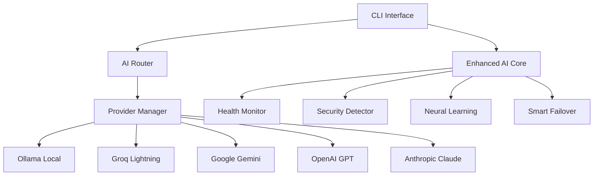

# 🧠 IRIS AI Orchestration System - Knowledge Base

**Version**: 2.0 Production Ready  
**Last Updated**: September 1, 2025  
**Maintainer**: Jordan After Midnight

---

## 📚 Table of Contents

1. [System Overview](#-system-overview)
2. [Architecture Deep Dive](#-architecture-deep-dive)
3. [Provider Ecosystem](#-provider-ecosystem)
4. [Core Features](#-core-features)
5. [API Reference](#-api-reference)
6. [Configuration](#-configuration)
7. [Performance Optimization](#-performance-optimization)
8. [Security Framework](#-security-framework)
9. [Troubleshooting](#-troubleshooting)
10. [Best Practices](#-best-practices)

---

## 🌟 System Overview

### What is IRIS?

IRIS (Integrated Runtime Intelligence Service) is an advanced AI orchestration system that intelligently routes queries to the most suitable AI provider based on:

- **Task Type Analysis**: Automated classification of queries (code, creative, fast, reasoning)
- **Provider Health Monitoring**: Real-time availability and performance tracking
- **Cost Optimization**: Preferential routing to free/low-cost providers when possible
- **Quality Assurance**: Failover mechanisms and response validation

### Core Philosophy

1. **Cost-First Approach**: Prioritize free local models (Ollama) over paid services
2. **Intelligent Routing**: Match tasks to provider strengths automatically
3. **Reliability Through Redundancy**: Multiple provider fallbacks ensure uptime
4. **Security by Design**: Built-in threat detection and input validation

---

## 🏗️ Architecture Deep Dive

### System Components



### Data Flow Architecture

1. **Query Ingestion** → Input validation and sanitization
2. **Task Classification** → Automatic task type determination
3. **Provider Selection** → Health-based intelligent routing
4. **Execution** → Query processing with timeout management
5. **Response Processing** → Output validation and formatting
6. **Learning Feedback** → Performance data collection

### Key Design Patterns

- **Strategy Pattern**: Provider selection algorithms
- **Circuit Breaker**: Failover mechanism implementation
- **Observer Pattern**: Real-time health monitoring
- **Factory Pattern**: Provider instantiation
- **Decorator Pattern**: Response enhancement and formatting

---

## 🔌 Provider Ecosystem

### Provider Hierarchy (Priority Order)

#### 1. **Ollama (Local) - Priority 1**
- **Cost**: FREE ⭐⭐⭐⭐⭐
- **Speed**: Fast ⭐⭐⭐⭐
- **Privacy**: Excellent ⭐⭐⭐⭐⭐
- **Best For**: Code generation, general queries, privacy-sensitive tasks
- **Models**: qwen2.5:7b, mistral:7b, deepseek-coder:6.7b
- **Limitations**: Requires local installation, model-dependent quality

#### 2. **Groq - Priority 2**
- **Cost**: Low ⭐⭐⭐⭐
- **Speed**: Ultra-fast ⭐⭐⭐⭐⭐
- **Quality**: Good ⭐⭐⭐
- **Best For**: Quick queries, fast responses, simple tasks
- **Models**: llama-3.1-8b-instant, mixtral-8x7b-32768
- **Limitations**: Rate limits, simpler responses

#### 3. **Google Gemini - Priority 3**
- **Cost**: Moderate ⭐⭐⭐
- **Speed**: Good ⭐⭐⭐
- **Quality**: Excellent ⭐⭐⭐⭐⭐
- **Best For**: Creative writing, multimodal tasks, analysis
- **Models**: gemini-1.5-flash, gemini-1.5-pro
- **Limitations**: API costs, usage quotas

#### 4. **OpenAI - Priority 4**
- **Cost**: High ⭐⭐
- **Speed**: Moderate ⭐⭐⭐
- **Quality**: Excellent ⭐⭐⭐⭐⭐
- **Best For**: Complex reasoning, advanced code, research
- **Models**: gpt-4o-mini, o1-preview, gpt-4
- **Limitations**: Expensive, rate limits

#### 5. **Anthropic Claude - Priority 5**
- **Cost**: High ⭐⭐
- **Speed**: Moderate ⭐⭐⭐
- **Quality**: Excellent ⭐⭐⭐⭐⭐
- **Best For**: Analysis, safety-critical tasks, long-form content
- **Models**: claude-3.5-sonnet, claude-3-opus
- **Limitations**: Most expensive, strict safety filters

---

## ⚡ Core Features

### 1. Smart Task Classification

IRIS automatically analyzes incoming queries and classifies them:

```javascript
// Automatic classification examples
"Write a Python function" → TASK_TYPE: code
"Create a story about AI" → TASK_TYPE: creative  
"What is 2+2?" → TASK_TYPE: fast
"Analyze this data trend" → TASK_TYPE: reasoning
```

### 2. Intelligent Provider Selection

```javascript
const selectionCriteria = {
    taskType: 'code',           // Determined automatically
    providerHealth: healthMap,   // Real-time health scores
    costConstraints: maxCost,    // Budget limitations
    qualityRequirements: minQuality, // Minimum response quality
    speedRequirements: maxLatency    // Maximum response time
};
```

### 3. Real-time Health Monitoring

- **Health Scores**: 0-100 scale based on response time, success rate, error frequency
- **Availability Checks**: Periodic ping tests to all providers
- **Performance Metrics**: Response time tracking, throughput measurement
- **Anomaly Detection**: Statistical analysis for performance degradation

### 4. Security Framework

- **Input Sanitization**: Removes potentially harmful content
- **Threat Detection**: Identifies injection attacks, jailbreaks
- **Response Filtering**: Validates output for safety
- **Audit Logging**: Comprehensive security event tracking

### 5. Neural Learning System

- **Pattern Recognition**: Learns optimal provider-task combinations
- **Performance Prediction**: Forecasts response quality and speed
- **Adaptive Routing**: Improves decisions based on historical data
- **User Preference Learning**: Adapts to individual usage patterns

---

## 🔧 API Reference

### Core Classes

#### MultiAI (Main Class)

```javascript
import MultiAI from './src/index.js';

const iris = new MultiAI({
    configPath: './config/iris-config.json',
    enableLogging: true
});

// Initialize providers
await iris.initializeProviders();

// Send query
const response = await iris.chat("Write a hello world program", {
    taskType: 'code',        // Optional: auto-detected if not provided
    provider: 'ollama',      // Optional: force specific provider
    maxCost: 0.01,          // Optional: budget constraint
    timeout: 30000,          // Optional: timeout in ms
    stream: false            // Optional: streaming response
});
```

#### Response Object Structure

```javascript
{
    response: "Generated text response",
    provider: "ollama",
    model: "qwen2.5:7b",
    responseTime: 1250,
    tokensUsed: 45,
    cost: 0.0,
    confidence: 0.95,
    contextLength: 150,
    decision: {
        reason: "Optimal for code generation tasks",
        useMistral: true,
        alternatives: ["groq", "openai"]
    }
}
```

### Command Line Interface

```bash
# Basic usage
iris chat "Your question here"

# Task-specific routing
iris chat "Write a Python function" --task=code
iris chat "Create a story" --task=creative
iris chat "Quick answer needed" --task=fast

# Provider selection
iris chat "Hello world" --provider=ollama
iris chat "Complex analysis" --provider=openai

# System management
iris providers          # List provider status
iris health            # System health check
iris models           # Available models
iris status           # Comprehensive system status
```

### Web Dashboard API

```javascript
// Query endpoint
POST /api/chat
{
    "message": "Your question",
    "provider": "auto",     // Optional
    "taskType": "balanced"  // Optional
}

// Health endpoint
GET /api/health

// Provider status
GET /api/providers
```

---

## ⚙️ Configuration

### Main Configuration File (iris-config.json)

```json
{
    "routing": {
        "maxCost": 0.05,
        "timeout": 30000,
        "retryAttempts": 3,
        "fallbackEnabled": true
    },
    "providers": {
        "ollama": {
            "host": "http://localhost:11434",
            "enabled": true,
            "priority": 1,
            "models": ["qwen2.5:7b", "mistral:7b"]
        },
        "groq": {
            "enabled": true,
            "priority": 2,
            "rateLimitRpm": 100
        },
        "gemini": {
            "enabled": true,
            "priority": 3,
            "safetySettings": "strict"
        },
        "openai": {
            "enabled": false,
            "priority": 4,
            "organization": "your-org-id"
        }
    },
    "security": {
        "inputValidation": true,
        "threatDetection": true,
        "auditLogging": true
    },
    "monitoring": {
        "healthCheckInterval": 30000,
        "metricsRetention": 86400000
    }
}
```

### Environment Variables

```bash
# Required for external providers
export GROQ_API_KEY="your-groq-api-key"
export GEMINI_API_KEY="your-gemini-api-key"
export OPENAI_API_KEY="your-openai-api-key"
export ANTHROPIC_API_KEY="your-anthropic-api-key"

# Optional configurations
export OLLAMA_HOST="http://localhost:11434"
export IRIS_LOG_LEVEL="info"
export IRIS_MAX_COST="0.05"
```

---

## 🚀 Performance Optimization

### Response Time Optimization

1. **Provider Selection**
   - Use Ollama for general queries (fastest when available)
   - Use Groq for simple, quick responses
   - Cache frequently used responses

2. **Connection Pooling**
   - Maintain persistent connections to providers
   - Implement request queuing for rate-limited providers

3. **Caching Strategy**
   - Semantic similarity-based caching
   - Response caching with TTL
   - Provider health status caching

### Cost Optimization

1. **Intelligent Routing**
   ```javascript
   // Cost-optimized decision tree
   if (taskSimple && ollamaHealthy) return 'ollama';
   if (taskFast && groqAvailable) return 'groq';
   if (taskCreative && budgetAvailable) return 'gemini';
   return 'fallback';
   ```

2. **Budget Management**
   - Set daily/monthly cost limits
   - Track usage per provider
   - Alert when approaching limits

### Throughput Optimization

- **Concurrent Processing**: Handle multiple requests simultaneously
- **Batch Processing**: Group similar queries when supported
- **Streaming Responses**: For long-form content generation
- **Connection Reuse**: Minimize connection overhead

---

## 🛡️ Security Framework

### Input Validation

```javascript
const securityChecks = {
    sqlInjection: /(\b(SELECT|INSERT|UPDATE|DELETE|DROP)\b)/i,
    scriptInjection: /<script\b[^<]*(?:(?!<\/script>)<[^<]*)*<\/script>/gi,
    promptInjection: /(ignore previous|system prompt|jailbreak)/i,
    excessiveLength: input => input.length > 10000
};
```

### Threat Detection

1. **Input Analysis**
   - Pattern matching for common attacks
   - Entropy analysis for unusual patterns
   - Blacklist and whitelist validation

2. **Response Monitoring**
   - Content safety validation
   - Suspicious pattern detection
   - Automatic response filtering

3. **Audit Logging**
   - All security events logged
   - Threat attempt tracking
   - Performance impact monitoring

### Privacy Protection

- **Local Processing**: Prefer Ollama for sensitive data
- **Data Minimization**: Only send necessary context
- **Audit Trails**: Track all data handling
- **Anonymization**: Remove PII when possible

---

## 🔍 Troubleshooting

### Common Issues

#### 1. "Provider Not Available"
```bash
# Check provider status
iris providers

# Test specific provider
iris chat "test" --provider=ollama

# Check Ollama installation
curl http://localhost:11434/api/version
```

#### 2. "High Response Times"
- Check provider health scores
- Verify network connectivity
- Consider using Groq for faster responses
- Implement caching for repeated queries

#### 3. "Cost Limits Exceeded"
```javascript
// Check current usage
iris status --verbose

// Set cost limits
export IRIS_MAX_COST="0.10"
```

#### 4. "Authentication Errors"
```bash
# Verify API keys
echo $GROQ_API_KEY
echo $GEMINI_API_KEY

# Test API key validity
iris providers --test-auth
```

### Debug Mode

```bash
# Enable verbose logging
iris chat "test query" --verbose

# Debug specific provider
iris chat "test" --provider=ollama --debug

# System diagnostics
iris health --full-report
```

### Log Analysis

```bash
# View recent logs
tail -f ~/.iris/logs/iris.log

# Search for errors
grep "ERROR" ~/.iris/logs/iris.log

# Performance analysis
grep "responseTime" ~/.iris/logs/iris.log | tail -100
```

---

## 💡 Best Practices

### For Developers

1. **Task Type Specification**
   ```javascript
   // Explicit task typing for better routing
   await iris.chat("Write a function", { taskType: 'code' });
   ```

2. **Error Handling**
   ```javascript
   try {
       const response = await iris.chat(query);
   } catch (error) {
       if (error.code === 'PROVIDER_UNAVAILABLE') {
           // Handle provider failure
       }
   }
   ```

3. **Performance Monitoring**
   ```javascript
   const startTime = Date.now();
   const response = await iris.chat(query);
   console.log(`Response time: ${Date.now() - startTime}ms`);
   ```

### For Users

1. **Query Optimization**
   - Be specific in requests
   - Provide context when needed
   - Use appropriate language and formatting

2. **Provider Selection**
   - Use auto-selection for best results
   - Force specific providers only when needed
   - Consider cost implications

3. **Security Awareness**
   - Avoid sharing sensitive information
   - Be cautious with generated code
   - Verify important information independently

### For Operators

1. **System Monitoring**
   - Monitor provider health regularly
   - Set up alerts for failures
   - Track usage and costs

2. **Capacity Planning**
   - Monitor request patterns
   - Plan for peak usage
   - Scale resources appropriately

3. **Security Management**
   - Regular security audits
   - Update API keys regularly
   - Monitor for unusual patterns

---

## 📈 Analytics & Metrics

### Key Performance Indicators

1. **Response Quality**
   - User satisfaction scores
   - Response relevance ratings
   - Error rate tracking

2. **System Performance**
   - Average response time
   - Provider availability
   - Throughput metrics

3. **Cost Efficiency**
   - Cost per query
   - Provider cost distribution
   - Budget utilization

### Monitoring Dashboard

The web dashboard provides real-time visibility into:
- System health and status
- Provider performance metrics
- Usage patterns and trends
- Cost tracking and alerts
- Security event monitoring

---

## 🔮 Future Roadmap

### Planned Features

1. **Enhanced Learning**
   - Advanced ML-based routing
   - User preference learning
   - Contextual awareness

2. **Enterprise Features**
   - Multi-tenant support
   - SSO integration
   - Advanced analytics

3. **Provider Expansion**
   - More local model support
   - Custom provider integration
   - Edge computing support

### Version History

- **v2.0**: Production release with full orchestration
- **v1.9**: Enhanced dashboard and real AI integration
- **v1.8**: Security framework implementation
- **v1.7**: Neural learning system
- **v1.6**: Smart failover mechanism
- **v1.5**: Multi-provider integration

---

## 📞 Support & Community

### Getting Help

1. **Documentation**: Comprehensive guides available
2. **Issues**: GitHub issue tracker
3. **Discussions**: Community forum
4. **Email**: jordanaftermidnight@users.noreply.github.com

### Contributing

- **Code Contributions**: Pull requests welcome
- **Bug Reports**: Detailed issue reports
- **Feature Requests**: Enhancement proposals
- **Documentation**: Help improve guides

---

**Knowledge Base Version**: 2.0  
**Last Updated**: September 1, 2025  
**Next Review**: December 1, 2025

*This knowledge base is continuously updated to reflect the latest system capabilities and best practices.*